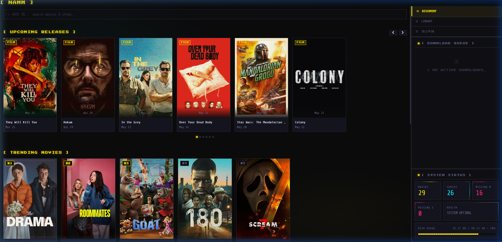
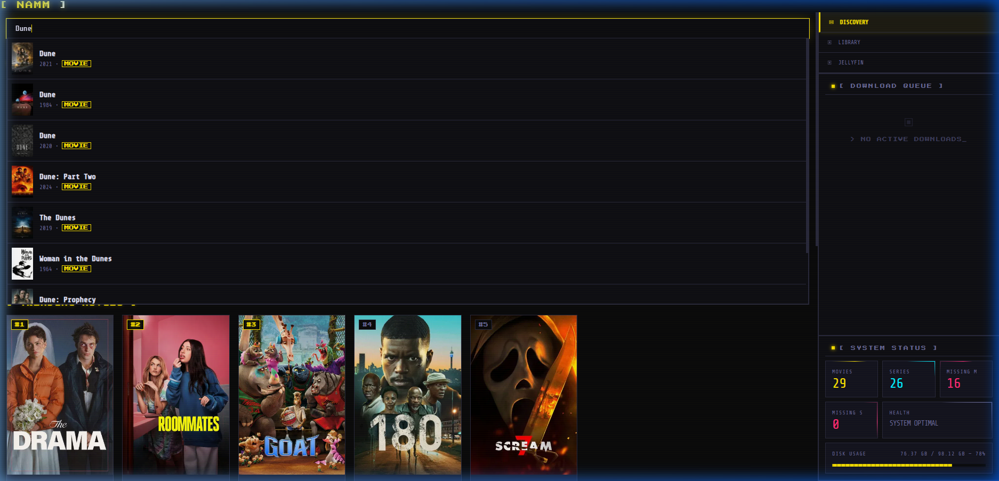
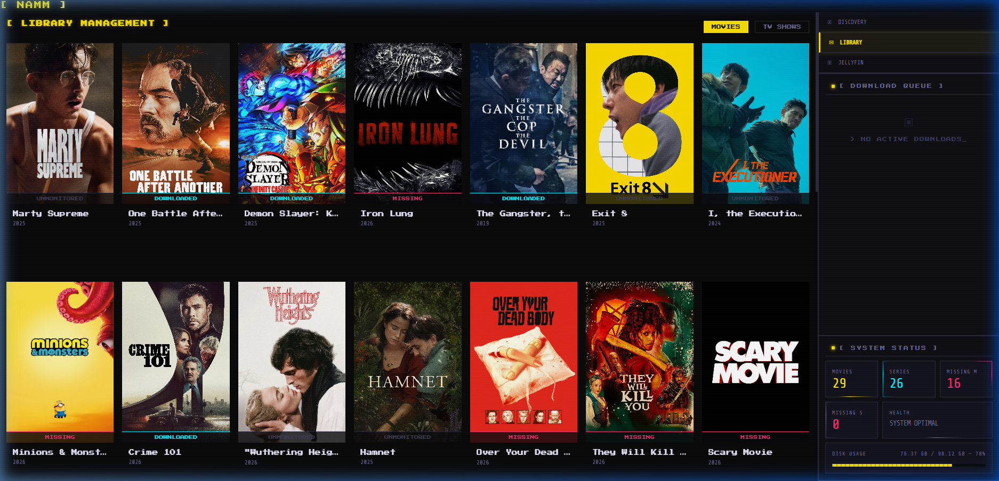
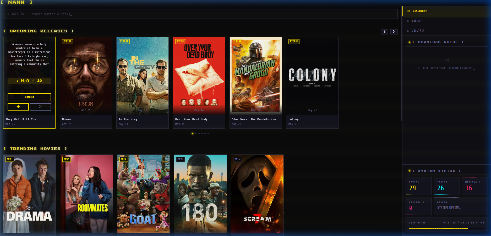

# [ NAMM ] — Not Another Media Manager

> *"Your media stack, jacked in."*

**NAMM** is an enterprise-grade, self-hosted PWA dashboard designed to manage your entire media ecosystem (Jellyfin, Radarr, Sonarr, Prowlarr) from a single, high-density Cyberpunk 2077-themed terminal.



---

## ⚡ Core Features

### 📡 Unified Discovery & Search
- **Universal Search**: Jack into TMDB and your local libraries simultaneously.
- **Smart Classifier**: Automatic routing for new content (Movies → Radarr, TV → Sonarr).
- **Premium Discovery**: Interactive trending and upcoming feeds with IMDB deep-linking and one-click management.


*Universal Search & Real-time Lookup*

### 📼 Native-Feel Management
- **Jellyfin Integration**: Native-looking media grid with drill-down views for all your libraries.
- **Library Tracker**: Monitor the status of your entire collection with real-time health indicators.
- **Action-First Workflow**: Rapidly add (`+`) or mark as seen (`×`) content directly from the discovery feed.


*Radarr Library View*


*Interactive Hover Overlays*

### 🖥️ Command Center Interface
- **High-Density Sidebar**: Merged download queue (Radarr + Sonarr) and real-time system metrics.
- **Cyberpunk Aesthetics**: ReactBits-powered animations (DecryptedText, BorderBeam, PixelTrail) and scanline CRT overlays.
- **PWA Ready**: Installable on desktop and mobile with offline shell support.

---

## 🛠️ Tech Stack

- **Build Engine**: Vite 5
- **Language**: Vanilla JavaScript (ES Modules)
- **Styling**: Vanilla CSS (Cyberpunk Design System)
- **PWA**: Workbox / `vite-plugin-pwa`
- **Infrastructure**: Docker / Nginx Alpine

---

## 🚀 Quick Start

### 1. Prerequisites
- Docker & Docker Compose
- API Keys for Radarr, Sonarr, Jellyfin, and TMDB

### 2. Environment Setup
Copy `.env.example` to `.env` and fill in your service details:
```env
# Jellyfin
VITE_JELLYFIN_URL=http://your-ip:8096
VITE_JELLYFIN_KEY=your_key

# Radarr
VITE_RADARR_URL=http://your-ip:7878
VITE_RADARR_KEY=your_key

# Sonarr
VITE_SONARR_URL=http://your-ip:8989
VITE_SONARR_KEY=your_key

# Discovery
VITE_TMDB_KEY=your_tmdb_key
```

### 3. Deploy
```bash
docker compose up -d
```
Your terminal is now live at `http://localhost:3500`.

---

## 🎨 Design Philosophy

NAMM follows a strict **"Information First"** philosophy inspired by Night City data terminals.
- **Zero Border Radius**: Hard pixel edges only.
- **Cyberpunk Palette**: CP Yellow (`#FCE300`), CP Cyan (`#00F0FF`), and deep monochrome surfaces.
- **Reactive UI**: Every interaction triggers a micro-animation or a "data-stream" effect.

---

## 📜 License
MIT © 2026. NAMM is for personal, self-hosted use.

*"The Net is wide and vast. Jack in and stay connected."*
